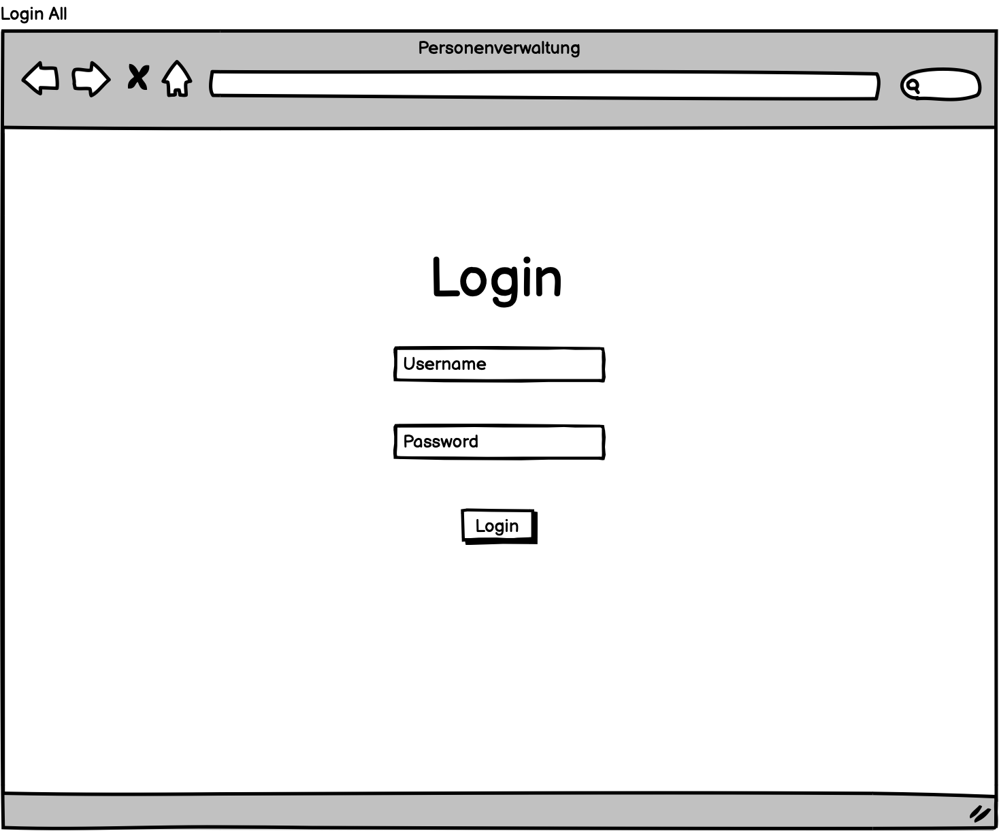
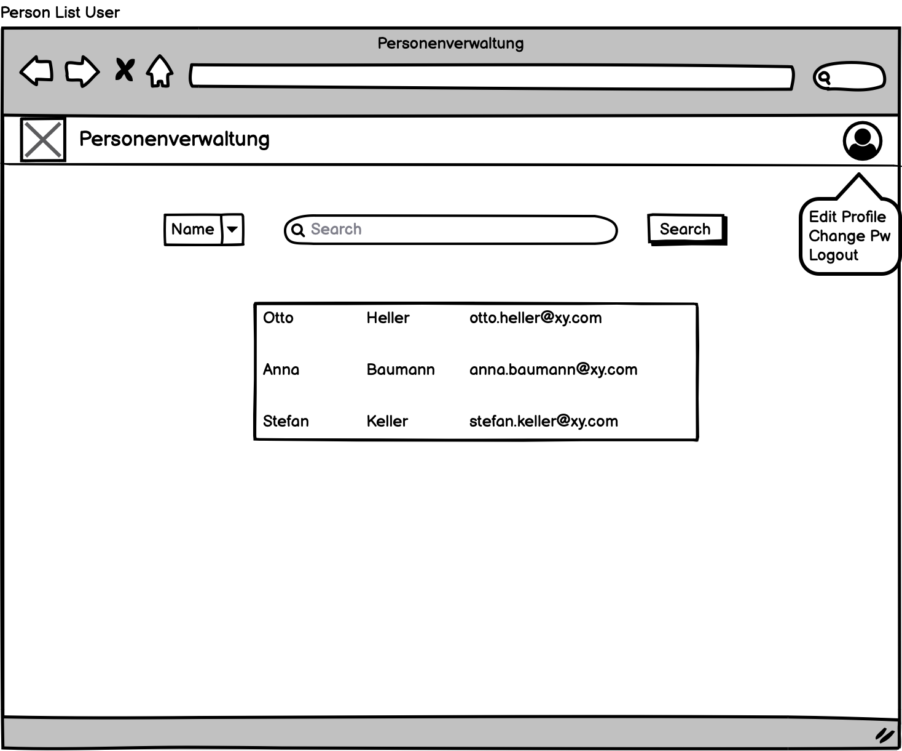
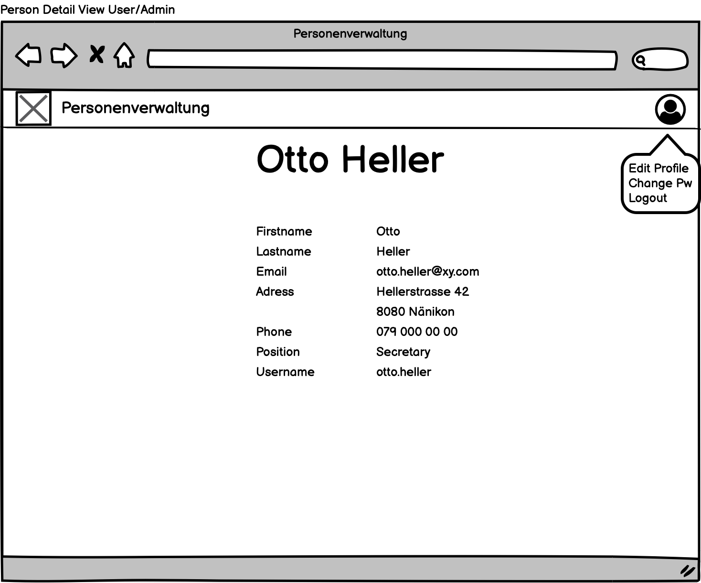
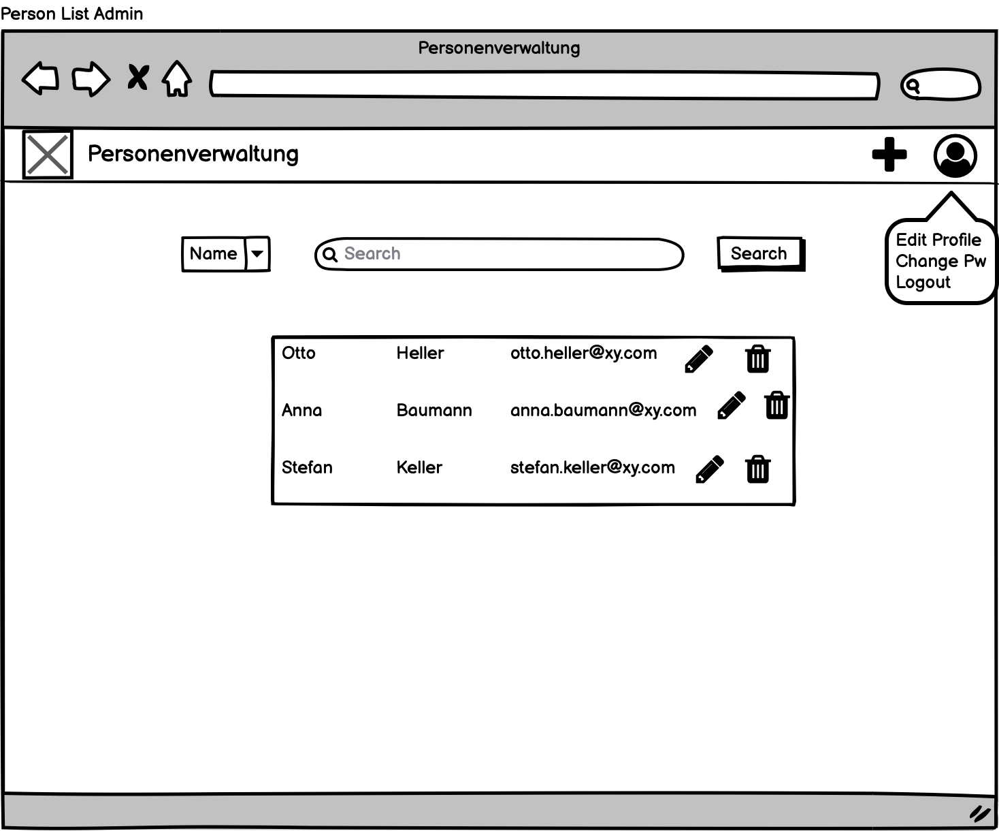
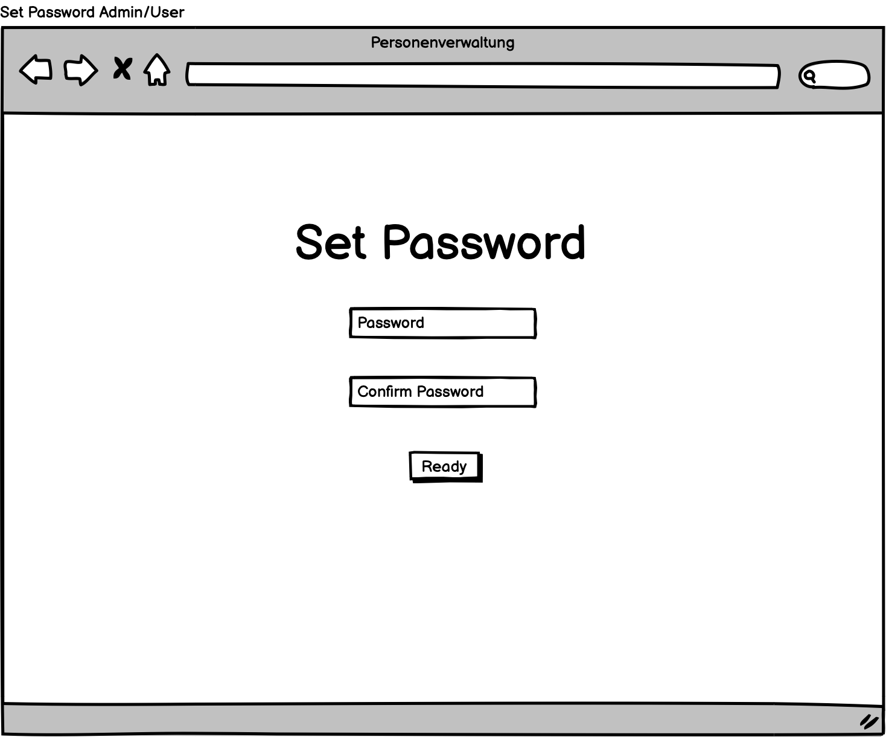
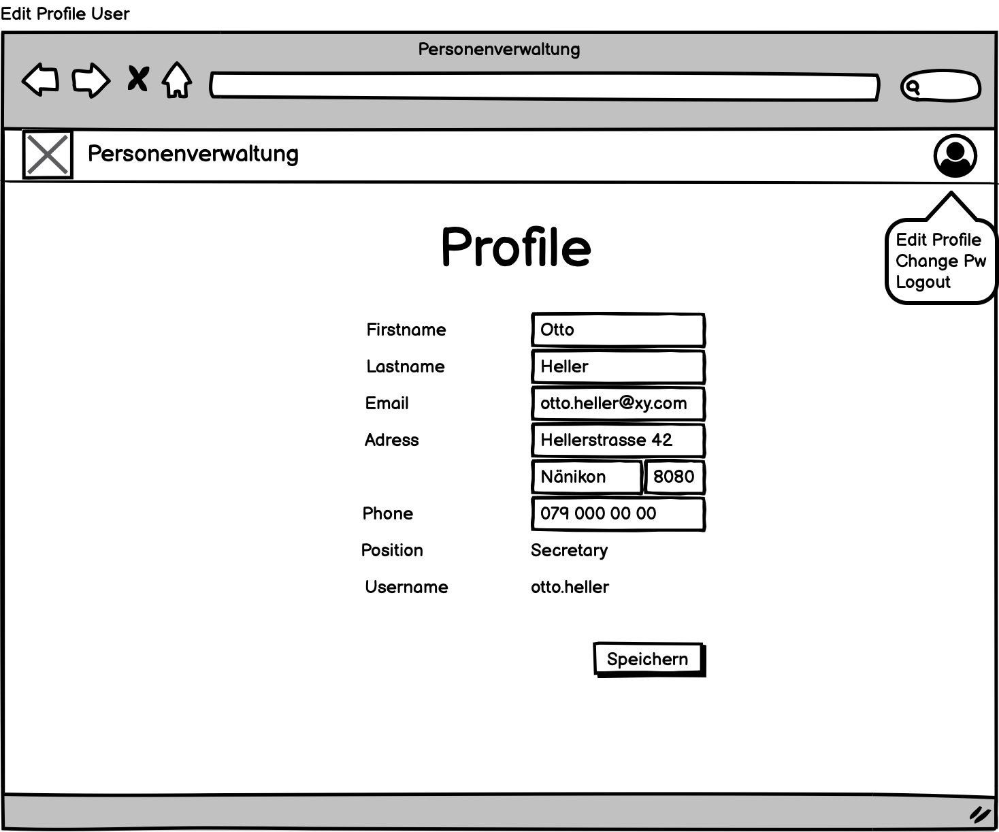
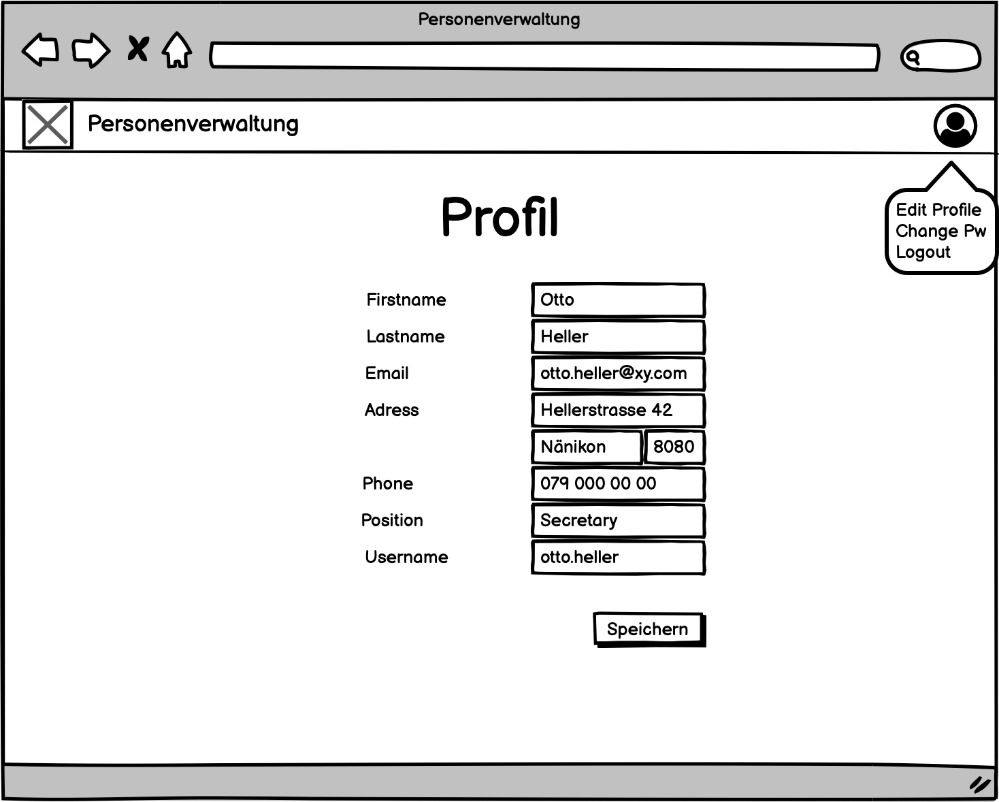
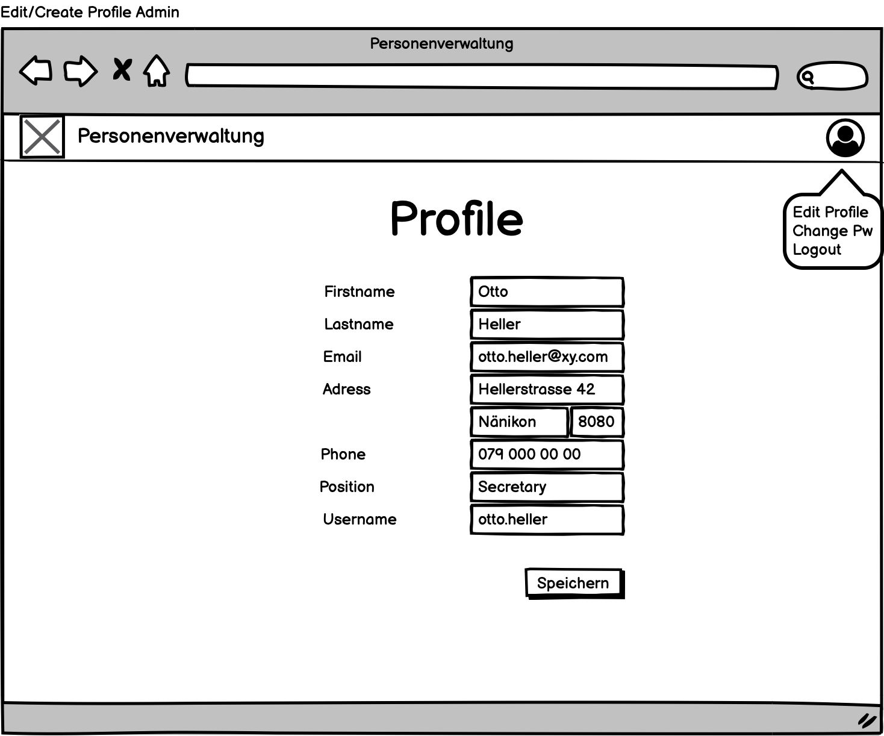
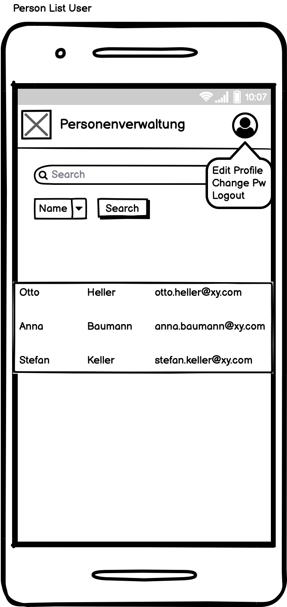
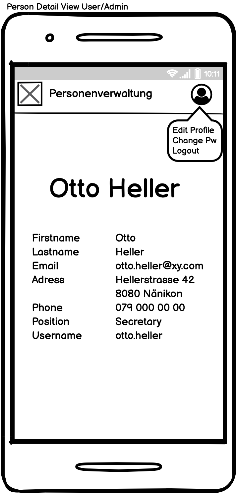

# M151 / M152 Personenverwaltung

## Einführung

In diesem Projekt erstellen wir eine Personenverwaltung für ein fiktives Unternehmen. Dazu gibt es Adminbenutzer, welche alle Benutzer verwalten können. Die "normalen" Benutzer haben ausschliesslich Leserechte auf alle Benutzer.

## Personengruppern

### Stefan Keller

- 61 Jahre alt
- Kadermitglied
- 11'000 Franken pro Monat

Stefan ist im Kader der Firma und möchte mit wenig Aufwand seine Mitarbeiter im System verwalten können. Stefan kennt sich nicht so gut mit Computern aus, deshalb sollte die Applikation für ihn möglichst einfach zu bedienen sein.

### Anna Baumann

- 35 Jahre alt
- HR Mitarbeiterin
- 6'000 Franken pro Monat

Anna arbeitet im HR und muss regelmässig Adressen und Telefonnummern von anderen Mitarbeitern nachschauen. Deshalb möchte sie möglichst einfach die Personalien eines Arbeitskollegen finden.

### Otto Heller

- 31 Jahre alt
- Sekretär
- 5'000 Franken pro Monat

Otto arbeitet im Sekretariat der Firma. Er zieht ungefähr vier Mal im Jahr um und möchte daher seine Adresse im Personenverwaltungstool schnell und einfach ändern.

## Userstories

Als Benutzer und Administrator möchte ich mich mit meinem Benutzeraccount Anmelden können, sodass die persönlichen Daten nur von Mitarbeitern angeschaut werden können.

Als Benutzer und Administrator möchte ich mich abmelden können, sodass eine höhere Sicherheit gewährleistet werden kann.

Als Benutzer und Administrator möchte ich die Personalien von allen meinen Arbeitskollegen sehen und suchen können, sodass ich Mitarbeitende einfach kontaktieren kann.

Als Benutzer und Administrator möchte ich meine eigenen Personalien editieren können, sodass ich bei einem Umzug oder sonstigen Änderungen meine Daten selbstständig anpassen kann.

Als Administrator möchte ich Benutzer sowie Administratoren anlegen, bearbeiten und löschen können, damit Firmenein- und Austritte einfach ablaufen können.

## Technologiestack
### Runtime
- Docker für alle Teile

### Frontend
- Vue3 als Framework
- Vuex als Store

### Backend
- Java Spring als Framework
- JPA als connector zur Datenbank
- Gradle als package manager

### Datenbank
- Dokumentbasiert, da die Personaldaten recht ineinander abgeschlossen sind.
- MongoDB als DB 

##Mockups

